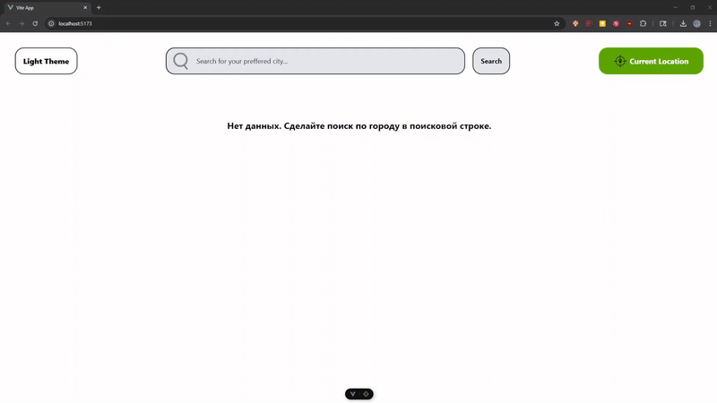

# Weather-App
Проект представляет собой веб-приложение по отображению погоды в выбранном населенном пункте c использованием Vue 3 и openweathermap API.

[**_<ins>Ссылка на приложение</ins>_**](https://weather-app-lime-mu-62.vercel.app/)

## 🚀 Демо 
*Пример работы приложения* 
  

## 🛠 Технологии  
- **Frontend**: Vue 3, Tailwind, Axios, Vite
- **Backend**: API https://openweathermap.org (Current weather API, 3-hour forecast for 5 days API)
- **Deploy**: Vercel  

## ⚡️ Функционал 
✅ Погода по Geolocation API (WEB API)

✅ Погода по названию населенного пункта

✅ Сохранение последнего населенного пункта в Localstorage

✅ Темная/светлая тема

✅ Сохранение последней темы в Localstorage

✅ Адаптивный интерфейс

## 🚀 Установка  
### Cоздать .env файл по примеру .env.example который есть в структуре проекта и внести туда api key из https://openweathermap.org (Current weather API, 3-hour forecast for 5 days API)
```bash
git clone https://github.com/chocopie777/weather-app.git

npm install

npm run dev